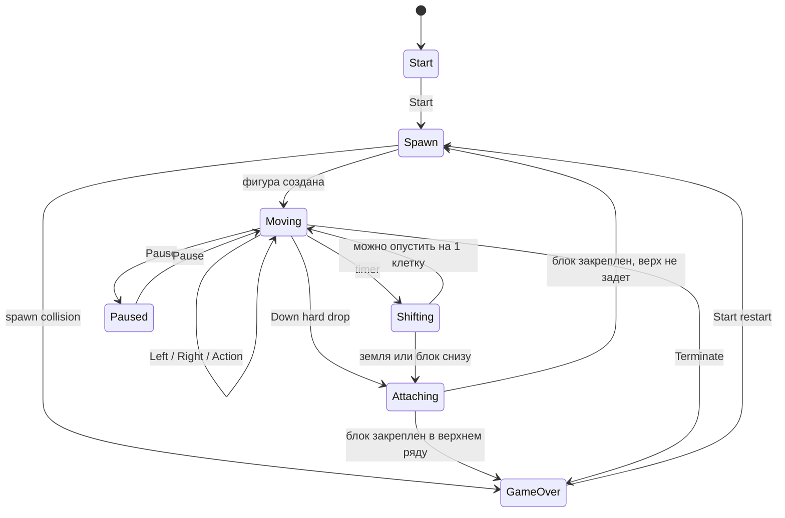

# Диаграмма конечного автомата BrickGame Tetris

Диаграмма описывает состояния библиотеки `src/brick_game/tetris` и переходы,
которые происходят после пользовательского ввода или таймера.

## Состояния

- `Start` — игра ожидает начала партии.
- `Spawn` — выбирается текущая фигура и генерируется следующая.
- `Moving` — основной игровой режим: сдвиг, вращение и hard drop.
- `Shifting` — автоматическое падение фигуры по таймеру.
- `Attaching` — фиксация фигуры на поле, очистка линий, начисление очков.
- `GameOver` — финальное состояние партии до нового `Start`.

Пауза в коде реализована флагом `GameInfo_t.pause`, чтобы внешний API оставался
совместимым со спецификацией BrickGame.
