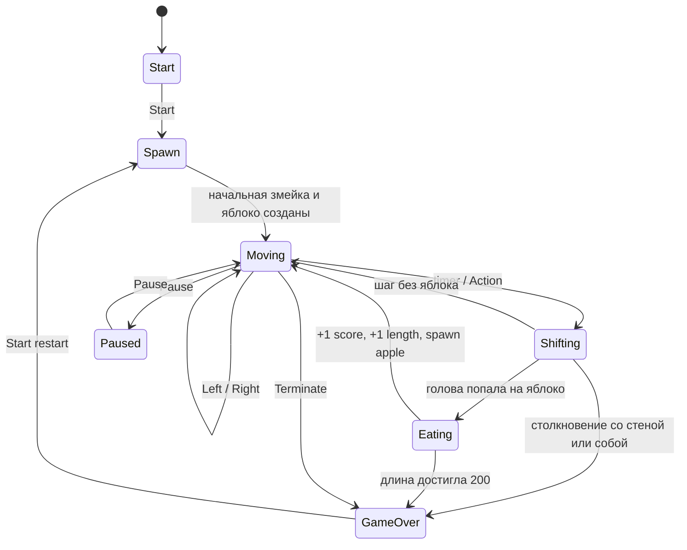

# Диаграмма конечного автомата BrickGame Snake

Диаграмма описывает состояния библиотеки `src/brick_game/snake` и переходы,
которые происходят после пользовательского ввода или истечения таймера.

## Состояния

- `Start` — ожидание начала партии.
- `Spawn` — создание начальной змейки длиной 4 и первого яблока.
- `Moving` — основной игровой режим: обработка относительных поворотов влево и вправо.
- `Shifting` — автоматический шаг змейки по таймеру или по клавише действия.
- `Eating` — обработка съеденного яблока: рост длины, очки, рекорд и уровень.
- `GameOver` — финальное состояние после проигрыша, победы или завершения игроком.

Пауза реализована флагом `GameInfo_t.pause`, чтобы внешний API оставался совместимым со спецификацией BrickGame.
