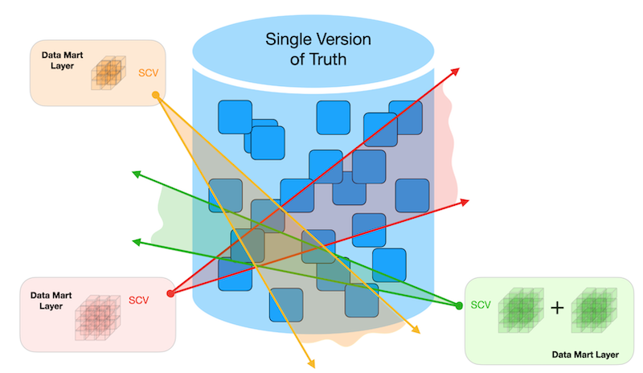
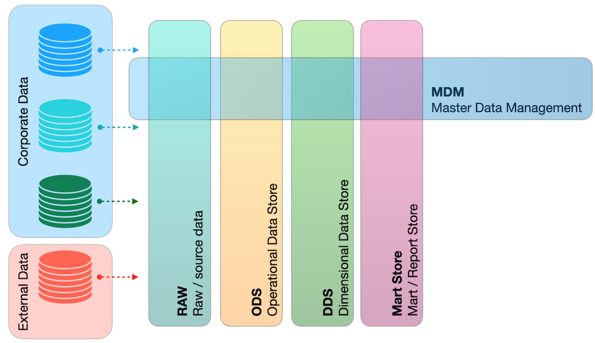
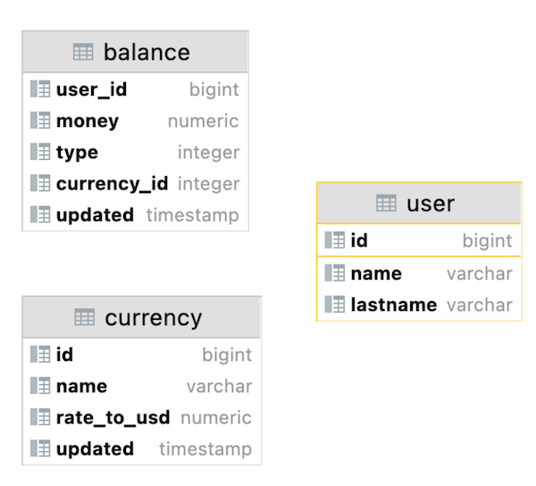
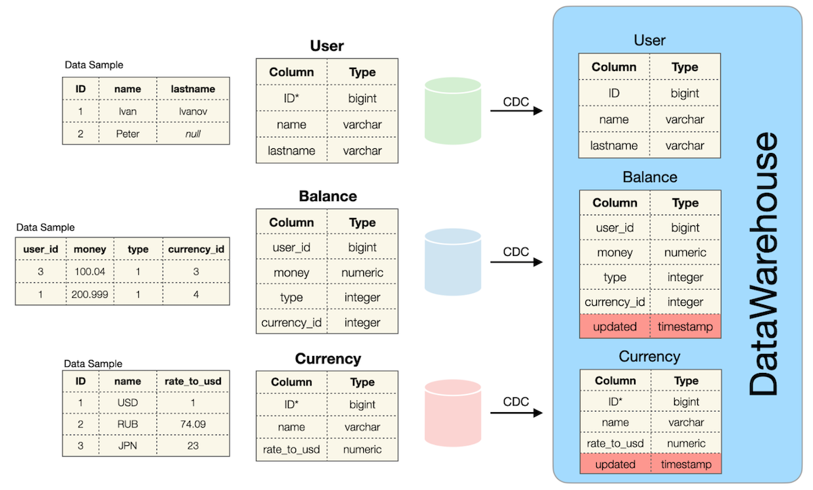
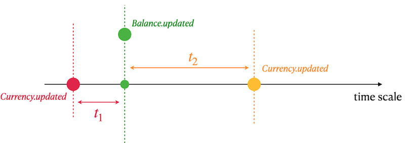

## _Data Warehouse_

In this team project, you'll explore how data warehouses (DWH) work and go through the entire process of building an ETL pipeline.

You'll write SQL queries that handle "imperfect" real-world data: finding missing values, joining information from different sources, and correctly aggregating metrics. These skills will prepare you for future tasks like building ETL pipelines, analyzing historical data, and preparing data for reporting — essential capabilities for almost any data team.

💡 [Tap here](https://new.oprosso.net/p/4cb31ec3f47a4596bc758ea1861fb624) **to leave your feedback on the project**. It's anonymous and will help our team make your educational experience better. We recommend completing the survey immediately after the project.

## Contents

- [How to learn at «School 21»](#how-to-learn-at-«school-21»)
- [Chapter I](#chapter-i)
- [Preamble](#preamble)
- [Chapter II](#chapter-ii)
- [Rules of the day](#rules-of-the-day)
- [Chapter III](#chapter-iii)
- [Exercise 00 — Classical DWH](#exercise-00--classical-dwh)
- [Exercise 01 — Detailed Query](#exercise-01--detailed-query)

## How to learn at «School 21»

- Here, you’ll find a unique learning experience with a lot of freedom. You’re given a task and left to find your own way to solve it, using whatever resources work best for you — whether that’s the Internet or AI tools like GigaChat. Just be mindful of information quality: verify, think critically, analyze, and compare.
- Peer-to-peer (P2P) learning is the exchange of knowledge and experience with peers, where everyone acts as both mentor and student. This approach allows you to gain a deeper understanding of the material by learning from one another.
- Feel free to ask for help: around you are peers who are also navigating this path for the first time. Share your own experience and ideas with others.  Join Rocket.Chat to stay updated with the latest community announcements. 
- Your learning is meaningless if you just copy someone else’s solutions. When receiving help from others, always make sure you fully understand the “why”, “how”, and “purpose” behind the solution. Don’t be afraid to make mistakes. 
- Does the task seem impossible? Take a break, get some fresh air and clear your mind — this has helped many people. Maybe after that, the solution will come to you naturally.
- The learning process is just as important as the result. It’s not just about completing the task — it’s about understanding HOW to solve it. 

How to work with the project:

- Before starting, clone the project from GitLab into a repository with the same name.
- All files should be created inside the _src/_ folder of the cloned repository.
- After cloning the project, create a _develop_ branch and do all your development there. Then, push the _develop_ branch to GitLab.
- Your directory should not contain any files other than those specified in the assignments.

## Chapter I
## Preamble

A Data Warehousing (DWH) is a process for collecting and managing data from disparate sources to provide meaningful business insights. A data warehouse is typically used to connect and analyze business data from heterogeneous sources. The data warehouse is the core of the BI system built for data analysis and reporting.

There are 2 DWH-"fathers" with opposing opinions on how to make a better DWH from logical data layers.

|  |  |
| ------ | ------ |
| "A DWH is a subject-oriented, integrated, non-volatile, and time-varying collection of data to support management decisions." (Bill Inmon) |  |
|  | "A DWH is a system that extracts, cleanses, conforms, and delivers source data into a dimensional data store, and then supports and implements query and analysis for decision making." (Ralph Kimball) |

Nowadays, Big Data is coming more and more and we need more resources to control, structure and further explore our data. To support classical DataWareHouse systems, there is a new pattern called LakeHouse (based on λ-architecture) = DataLake + DataWareHouse. From a logical point of view, we can imagine a modern LakeHouse as a set of logical data layers.

Therefore, to be a Data Architect you need to know a "bit more" than Relational Modeling. 
Let's look at the list of existing Data Models Patterns: 
- Relational Model,
- Temporal Model,
- BiTemporal Model,
- USS Model,
- EAV Model,
- Star / Snowflake Models,
- Galaxy Model,
- Data Vault Model,
- Anchor Model,
- Graph Model.

## Chapter II
## Rules of the day

- Please make sure you have your own database and access to it on your PostgreSQL cluster. 
- All tasks contain a list of Allowed and Denied sections with listed database options, database types, SQL constructions etc. Please have a look at the section before you start.
- Please download a [script](materials/rush01_model.sql) with Database Model here and apply the script to your database (you can use command line with psql or just run it through any IDE, for example DataGrip from JetBrains or pgAdmin from PostgreSQL community). 
- Please take a look at the Logical View of our Database Model. 
- And may the SQL-Force be with you!
- Absolutely anything can be represented in SQL! Let's get started and have fun!

## Chapter III
## Exercise 00 — Classical DWH

| Exercise 00: Classical DWH|                                                                                                                          |
|---------------------------------------|--------------------------------------------------------------------------------------------------------------------------|
| Turn-in directory                     | ex00                                                                                                                     |
| Files to turn-in                      | `team01_ex00.sql`                                                                           |
| **Allowed**                               |                                                                                                                          |
| Language                        |  SQL|

Let's take a look at the data sources and the first logical data layer (ODS — Operational Data Store) in the DWH.

`User` table Definition (in a Green Source Database):

| Column Name | Description |
| ------ | ------ |
| ID | Primary Key |
| name | Name of User |
| lastname | Last name of User |

`Currency` table Definition (in a Red Source Database):

| Column Name | Description |
| ------ | ------ |
| ID | Primary Key |
| name | Currency Name |
| rate_to_usd | Ratio to USD currency |

`Balance` table Definition (in a Blue Source Database):

| Column Name | Description |
| ------ | ------ |
| user_id | "Virtual Foreign Key" to User table from other source |
| money | Amount of money |
| type | Type of balance (can be 0,1,...) |
| currency_id | "Virtual Foreign Key" to Currency table from other source |

Green, Red, and Blue databases are independent data sources and fit the microservice pattern. This means that there is a high risk of data anomalies (see below).
- Tables are not in data consistency. It means that there is a User, but there are no rows in the Balance table, or vice versa, there is a Balance, but there are no rows in the User table. The same situation exists between the Currency and Balance tables. (In other words, there are no explicit foreign keys between them).
- Possible NULL values for Name and Lastname in the User table.
- All tables are working under OLTP (OnLine Transactional Processing) SQL traffic. It means that there is a current state of data at a time, historical changes are not stored for each table.

These 3 listed tables are data sources for the tables with similar data models in the DWH area.

`User` table Definition (in a DWH Database):

| Column Name | Description |
| ------ | ------ |
| ID | Primary Key |
| name | Name of User |
| lastname | Last name of User |

`Currency` table Definition (in a DWH Database):

| Column Name | Description |
| ------ | ------ |
| ID | Mocked Primary Key |
| name | Currency Name |
| rate_to_usd | Ratio to USD currency |
| updated | Timestamp of event from source database |

`Mocked Primary Key` means that there are duplicates with the same ID because a new updated attribute has been added that changes our Relational Model to Temporal Relational Model. 

Please take a look at the data sample for currency "EUR" below.
This example is based on the SQL statement:

    SELECT *
    FROM Currency
    WHERE name = ‘EUR’
    ORDER BY updated DESC;

| ID | name | rate_to_usd | updated |
| ------ | ------ | ------ | ------ |
| 100 | EUR | 0.9 | 03.03.2022 13:31 |
| 100 | EUR | 0.89 | 02.03.2022 12:31 |
| 100 | EUR | 0.87 | 02.03.2022 08:00 |
| 100 | EUR | 0.9 | 01.03.2022 15:36 |
| ... | ... | ... | ... |

`Balance` table Definition (in a DWH Database):

| Column Name | Description |
| ------ | ------ |
| user_id | "Virtual Foreign Key" to User table from other source |
| money | Amount of money |
| type | Type of balance (can be 0,1,...) |
| currency_id | "Virtual Foreign Key" to Currency table from other source |
| updated | Timestamp of event from source database |

Please take a look at the data sample.
This example is based on the SQL statement:

    SELECT *
    FROM Balance
    WHERE user_id = 103
    ORDER BY type, updated DESC;

| user_id | money | type | currency_id | updated |
| ------ | ------ | ------ | ------ | ------ |
| 103 | 200 | 0 | 100 | 03.03.2022 12:31 |
| 103 | 150 | 0 | 100 | 02.03.2022 11:29 |
| 103 | 15 | 0 | 100 | 03.03.2022 08:00 |
| 103 | -100 | 1 | 102 | 01.03.2022 15:36 |
| 103 | 2000 | 1 | 102 | 12.12.2021 15:36 |
| ... | ... | ... | ... |... |

All tables in the DWH inherit all anomalies from the source tables.
- Tables are not in data consistency. 
- Possible NULL values for Name and Lastname in the User table.

Please write an SQL statement that returns the total volume (sum of all money) of transactions from the user balance aggregated by user and balance type. Note that all data should be processed, including data with anomalies. Below is a table of result columns and the corresponding calculation formula.

| Output Column | Formula (pseudocode) |
| ------ | ------ |
| name | source: user.name if user.name is NULL then return `not defined` value |
| lastname | source: user.lastname if user.lastname is NULL then return `not defined` value |
| type | source: balance.type | 
| volume | source: balance.money need to summarize all money “movements” | 
| currency_name | source: currency.name if currency.name is NULL then return `not defined` value | 
| last_rate_to_usd | source: currency.rate_to_usd. take a last currency.rate_to_usd for corresponding currency if currency.rate_to_usd is NULL then return 1 | 
| total_volume_in_usd | source: volume , last_rate_to_usd. make a multiplication between volume and last_rate_to_usd |

See a sample of the output data below. Sort the result by User Name in descending order, and then by User Lastname and Balance type in ascending order.

| name | lastname | type | volume | currency_name | last_rate_to_usd | total_volume_in_usd |
| ------ | ------ | ------ | ------ | ------ | ------ | ------ |
| Петр | not defined | 2 | 203 | not defined | 1 | 203 |
| Иван | Иванов | 1 | 410 | EUR | 0.9 | 369 |
| ... | ... | ... | ... | ... | ... | ... |

## Exercise 01 — Detailed Query

| Exercise 01: Detailed Query|                                                                                                                          |
|---------------------------------------|--------------------------------------------------------------------------------------------------------------------------|
| Turn-in directory                     | ex01                                                                                                                     |
| Files to turn-in                      | `team01_ex01.sql`                                                                             |
| **Allowed**                               |                                                                                                                          |
| Language                        | ANSI SQL|

Before diving deeper into this task, please apply the following INSERT statements.

`insert into currency values (100, 'EUR', 0.85, '2022-01-01 13:29');`
`insert into currency values (100, 'EUR', 0.79, '2022-01-08 13:29');`

Please write an SQL statement that returns all Users, all Balance transactions (in this task please ignore Currencies that do not have a key in the `Currency` table) with currency name and calculated value of the currency in USD for the next day.

Below is a table of result columns and the corresponding calculation formula.

| Output Column | Formula (pseudocode) |
| ------ | ------ |
| name | source: user.name if user.name is NULL then return `not defined` value |
| lastname | source: user.lastname if user.lastname is NULL then return `not defined` value |
| currency_name | source: currency.name | 
| currency_in_usd | involved sources: currency.rate_to_usd, currency.updated, balance.updated.Take a look at a graphical interpretation of the formula below.| 

- You need to find a nearest rate_to_usd of currency in the past (t1).
- If t1 is empty (means no rates in the past), then find a nearest rate_to_usd of currency in the future (t2).
- Use t1 OR t2 rate to calculate a currency in USD format.

See a sample of the output below. Sort the result by User Name in descending order and then by User Lastname and Currency name in ascending order.

| name | lastname | currency_name | currency_in_usd |
| ------ | ------ | ------ | ------ |
| Иван | Иванов | EUR | 150.1 |
| Иван | Иванов | EUR | 17 |
| ... | ... | ... | ... |

